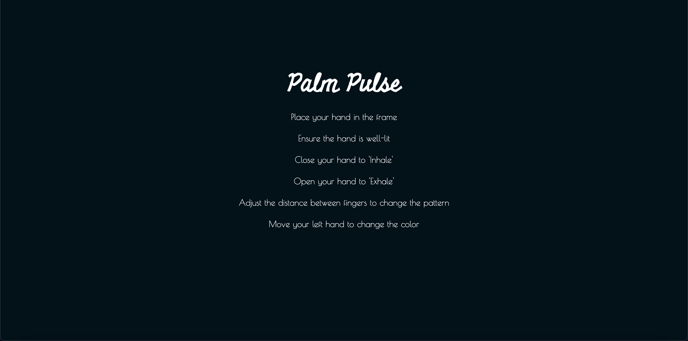

## Project Overview

I wanted to experiment with a new kind of meditation technique that makes the experience more interactive for the user, allowing them to customize it as they like. Initially, I wanted a box breathing visualization where users could draw a box on the screen and sync their breathing with it. To implement this, I used Teachable Machine, but it only recognized my face. Since I wanted the application to be accessible to a wider audience, I realized this approach wouldn't work.

I then adjusted my idea to use handPose, which can be utilized by anyone. Initially, I implemented simple ellipses that expanded and contracted as the user opened and closed their hands. To enhance the experience and allow for more customization, I added features that let users:

- Change the color using their left hand.
- Adjust the number of circles by moving the mouse left or right.
- Control the brightness by moving the mouse up or down.

[Github repository](https://github.com/yaashnaa/IC-assignment6.git)
## References

This project draws inspiration and builds upon the following resources:

1. [Interactive Kaleidoscope - Riddhi Mehta](https://editor.p5js.org/ri1/sketches/nfzi4e0V5)
2. [Kaleidoscope Example on p5.js](https://p5js.org/examples/repetition-kaleidoscope/)
3. [Hand Tracking Tutorial on p5.js](https://p5js.org/tutorials/speak-with-your-hands/)

